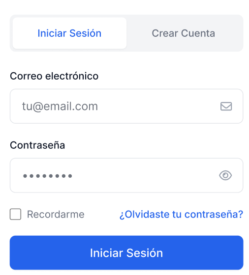

# Inicio de la aplicacion y acceso

## Inicio de la aplicacion

Cuando el usuario abre la app, TravelHub presenta una experiencia centrada en busqueda rapida, notificaciones y acceso al perfil.

## Inicio de sesion

### Paso a paso

1. Abra la app movil.
2. Ingrese a la pantalla `Login Form`.
3. Escriba su correo y contrasena.
4. Confirme el acceso.

**Resultado esperado**  
El usuario entra a la pantalla principal de busqueda o a la vista de inicio del viajero.

## Registro de usuario

La app incluye una pantalla de creacion de cuenta con campos para nombre completo, correo, contrasena y confirmacion de contrasena.

### Paso a paso

1. Seleccione la opcion para crear cuenta.
2. Ingrese su nombre completo y correo electronico.
3. Cree una contrasena y confirmela.
4. Acepte los terminos requeridos.
5. Presione el boton para completar el registro.

**Resultado esperado**  
La cuenta queda creada y el usuario puede continuar con el acceso a la aplicacion.

## Navegacion movil

En la aplicacion movil se observan elementos frecuentes de navegacion:

- Encabezado con TravelHub.
- Acceso a notificaciones.
- Acceso al perfil.
- Regreso a pantallas previas.
- Navegacion entre busqueda, reservas y detalle.
