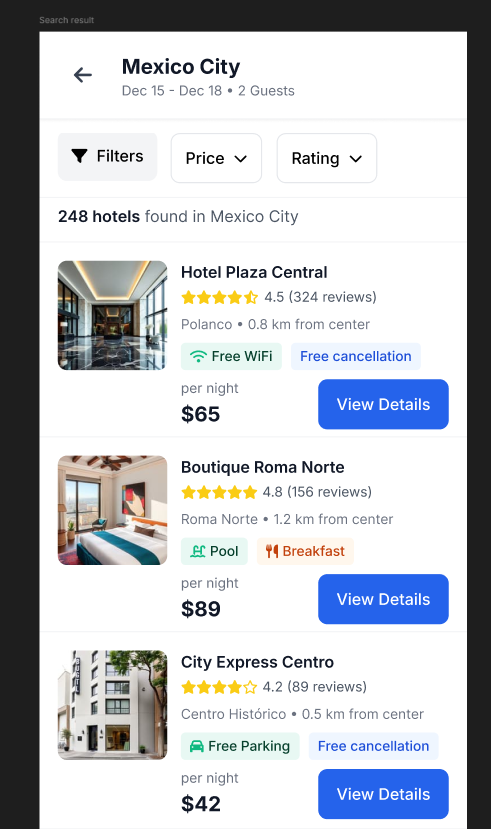

# Busqueda de hospedajes y detalle del alojamiento

## Busqueda desde `Search Home`

La pantalla principal movil incluye campos para:

- Destino.
- Check-in.
- Check-out.
- Guests.
- Boton `Search Hotels`.

### Paso a paso

1. Ingrese el destino.
2. Seleccione fechas de entrada y salida.
3. Defina la cantidad de huespedes.
4. Presione `Search Hotels`.

**Resultado esperado**  
La aplicacion muestra los resultados disponibles.

## Resultados y seleccion de alojamiento

Desde `Search Results`, el usuario puede revisar opciones y entrar al detalle del alojamiento.

### Paso a paso

1. Revise la lista de alojamientos.
2. Compare nombre, precio y atributos visibles.
3. Seleccione el alojamiento de interes.
4. Abra el detalle para continuar.

## Detalle del alojamiento

La app muestra la informacion esencial del alojamiento antes de continuar con la reserva.

### Informacion visible

- Fotos o imagen principal.
- Nombre del hotel.
- Tipo de habitacion.
- Fechas.
- Calificacion.
- Informacion relevante para reservar.

### Paso a paso

1. Abra un alojamiento desde `Search Results`.
2. Revise la imagen principal y el nombre del hotel.
3. Verifique habitacion, fechas y condiciones de la estancia.
4. Continue al proceso de reserva si la opcion se ajusta a su viaje.
