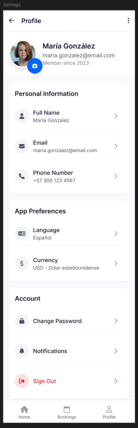

# Notificaciones, QR check-in y ajustes

## Notificaciones

En la cabecera de la vista movil se observa un icono de notificaciones. A traves de este espacio, el usuario puede identificar avisos relacionados con su actividad en la aplicacion, por ejemplo:

- Confirmacion de reserva.
- Estado pendiente.
- Cambios de estado.
- Recordatorios previos al viaje.

## Uso de QR check-in si aplica

La aplicacion incluye pantallas `Check-in Confirmation` y `Check-in Confirmation 2` para completar el check-in digital.

### Paso a paso

1. Abra la reserva correspondiente.
2. Ingrese a la opcion de check-in digital.
3. Revise la confirmacion de identidad y los datos solicitados.
4. Verifique el estado `QR Code Verified`.
5. Complete la confirmacion para finalizar el check-in.

**Resultado esperado**  
El usuario completa la validacion de identidad y obtiene la confirmacion final del check-in.

## Ajustes basicos de usuario

La pantalla `Profile Details` permite administrar:

- Datos personales.
- Informacion de contacto.
- Preferencias basicas del usuario.

