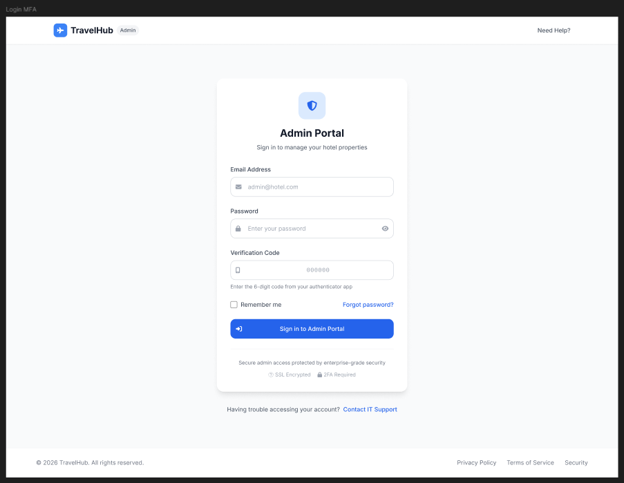

# Inicio de sesion administrativo

## Objetivo

Describir el acceso al portal para usuarios con perfil administrativo.

## Inicio de sesion

La pantalla `Admin Login` muestra un acceso reforzado con correo, contrasena y codigo de verificacion.

### Paso a paso

1. Abra el portal administrativo.
2. Ingrese el correo corporativo o autorizado.
3. Ingrese la contrasena.
4. Digite el `Verification Code` de 6 digitos.
5. Si lo necesita, active `Remember me`.
6. Presione `Sign in to Admin Portal`.

**Resultado esperado**  
El usuario entra al panel administrativo de TravelHub.

## Validaciones relevantes

- Formato correcto del correo.
- Contrasena valida.
- Codigo MFA vigente.
- Mensaje de error si el acceso no es exitoso.
