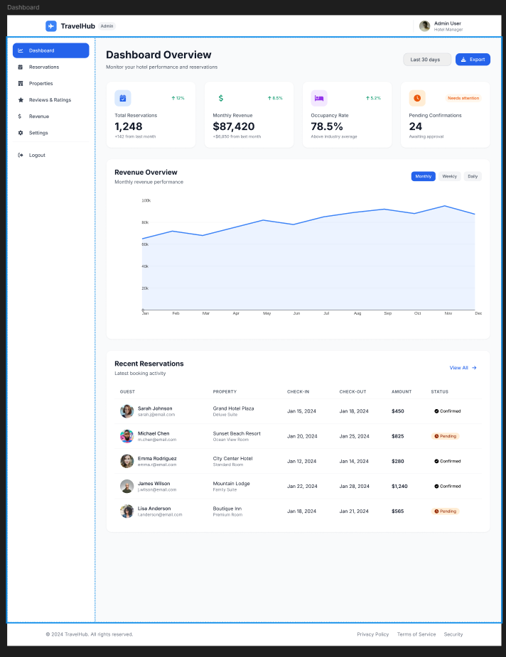

# Manual del portal administrativo

El portal administrativo de TravelHub permite gestionar reservas, revisar indicadores del negocio y ejecutar tareas operativas asociadas al hotel o portafolio administrado.

## En esta seccion aprendera

- Como iniciar sesion como administrador.
- Como usar el panel principal.
- Como consultar y decidir sobre reservas.
- Como revisar tarifas, descuentos y reportes.
- Como identificar mensajes del sistema y validaciones relevantes.

## Pantallas principales

- `Login`
- `Login MFA`
- `Dashboard`
- `Reservations`
- `Reservation Details`
- `TravelHub - Revenue`
- `Settings`
- `Reviews`

