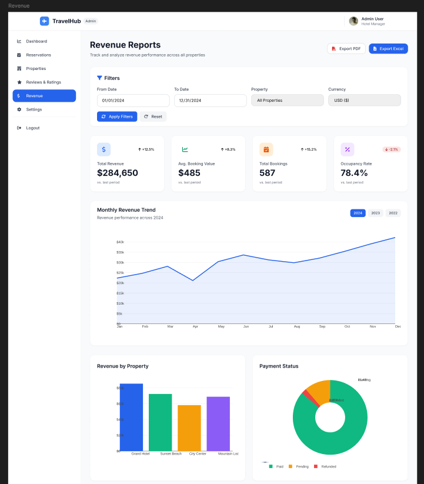

# Reportes e ingresos

## Reportes

La pantalla `Revenue Reports` permite revisar el desempeno economico del portafolio o de una propiedad.

## Elementos principales

- Titulo `Revenue Reports`.
- Botones `Export PDF` y `Export Excel`.
- Filtros por fecha, propiedad y moneda.
- Acciones `Apply Filters` y `Reset`.
- Tarjetas resumen de ingresos.

### Paso a paso

1. Abra la opcion `Revenue` en el menu lateral.
2. Defina el rango de fechas.
3. Seleccione la propiedad y la moneda si aplica.
4. Presione `Apply Filters`.
5. Revise los indicadores y graficos resultantes.
6. Exporte el reporte en el formato requerido.

**Resultado esperado**  
El administrador obtiene un reporte actualizado del desempeno economico.

## Uso sugerido de los reportes

- Seguimiento de ingresos por periodo.
- Comparacion entre propiedades.
- Validacion de tendencias de ocupacion e ingresos.
- Preparacion de reportes operativos o academicos.
