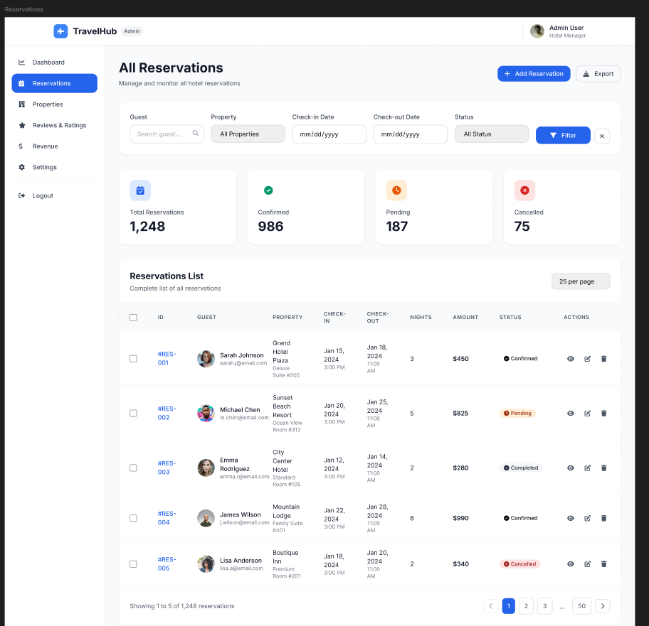

# Reservas administrativas

## Consulta y filtrado de reservas

La pantalla `All Reservations` permite administrar reservas de forma centralizada.

### Filtros disponibles

- Guest
- Property
- Check-in Date
- Check-out Date
- Status
- Botones `Filter` y limpieza de filtros

### Paso a paso

1. Abra la opcion `Reservations` del menu lateral.
2. Complete uno o varios filtros.
3. Presione `Filter`.
4. Revise los resultados y estadisticas.

**Resultado esperado**  
La tabla o listado muestra solo las reservas que cumplen los criterios.

## Visualizacion de detalle de reserva

La pantalla `Reservation Details` presenta la informacion ampliada de una reserva especifica.

### Informacion disponible

- Numero de reserva.
- Estado, por ejemplo `Pending Confirmation`.
- Fecha de creacion.
- Informacion del huesped.
- Acciones `Reject` y `Confirm`.

### Paso a paso

1. Ingrese al listado de reservas.
2. Seleccione una reserva.
3. Revise los datos del huesped y las condiciones de estancia.
4. Tome la decision operativa correspondiente.

## Confirmar o rechazar reservas

### Paso a paso

1. Abra `Reservation Details`.
2. Revise la informacion del huesped y el estado actual.
3. Presione `Confirm` para aprobar o `Reject` para rechazar.
4. Verifique el mensaje de resultado.

## Mensajes del sistema y validaciones relevantes

El sistema puede mostrar mensajes como:

- Reserva confirmada con exito.
- Reserva rechazada.
- Error de validacion por datos incompletos.
- Cambio de estado no permitido.
