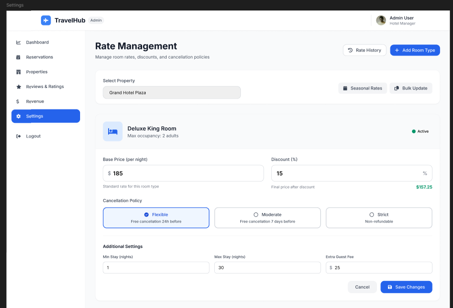

# Tarifas, descuentos y configuracion operativa

## Gestion de tarifas

La pantalla `Rate Management` en `Settings` permite administrar valores y condiciones de habitaciones.

### Elementos principales

- Selector de propiedad.
- Botones `Rate History`, `Add Room Type`, `Seasonal Rates` y `Bulk Update`.
- Informacion de tipo de habitacion.
- `Base Price (per night)`.
- Mencion a politicas de cancelacion dentro del contexto operativo.

### Paso a paso

1. Ingrese a `Settings`.
2. Seleccione la propiedad correspondiente.
3. Revise el tipo de habitacion.
4. Ajuste la tarifa base y otras condiciones visibles.
5. Guarde o confirme los cambios.

**Resultado esperado**  
Las tarifas del alojamiento quedan actualizadas para la operacion.

## Aplicacion de descuentos

La seccion de tarifas permite trabajar con ajustes estacionales y actualizaciones masivas para adaptar la oferta comercial de cada propiedad.

### Uso recomendado

1. Seleccione la propiedad.
2. Revise la tarifa base del tipo de habitacion.
3. Utilice las opciones de temporada o actualizacion masiva cuando necesite aplicar cambios amplios.
4. Confirme la actualizacion antes de salir de la pantalla.

## Gestion operativa basica

Desde `Settings`, el administrador tambien puede ajustar parametros que impactan la disponibilidad y la comercializacion.
