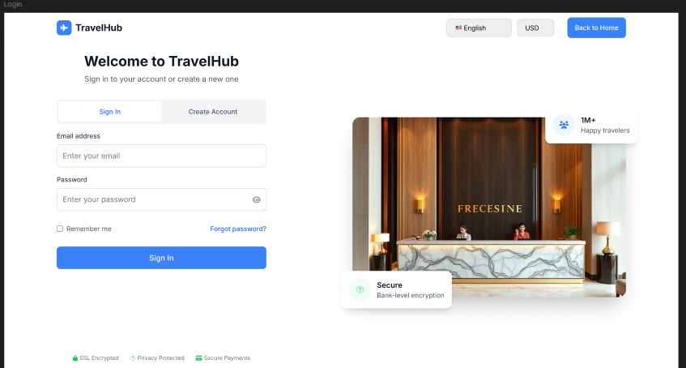

# Acceso, registro y recuperacion

## Objetivo

Explicar como un cliente ingresa al portal web, crea una cuenta o recupera el acceso.

## Inicio de sesion

### Paso a paso

1. Ingrese al portal web de TravelHub.
2. Ubique la opcion de acceso en la cabecera o pantalla de autenticacion.
3. Escriba su correo electronico y contrasena.
4. Seleccione la opcion para iniciar sesion.

**Resultado esperado**  
El usuario entra al entorno principal del portal y puede comenzar una busqueda o revisar sus reservas.

## Registro de usuario

La pantalla `Login` incorpora una vista de creacion de cuenta con la opcion `Create Account`.

### Paso a paso

1. Abra la pantalla `Login`.
2. Seleccione `Create Account`.
3. Ingrese los datos solicitados para el registro.
4. Cree y confirme la contrasena.
5. Finalice el proceso para habilitar el acceso a la plataforma.

**Resultado esperado**  
El usuario crea su cuenta y queda listo para iniciar sesion en TravelHub.

## Recuperacion de contrasena

### Paso a paso

1. Abra la pantalla `Login`.
2. Seleccione `Forgot password?`.
3. Ingrese el correo asociado a la cuenta.
4. Siga las instrucciones de recuperacion indicadas por la plataforma.

## Navegacion principal despues del acceso

En el portal web se observan opciones de navegacion como:

- `Traveler Home`
- `Search Results`
- `My Reservations`
- `Account & Preferences`

Estas opciones ayudan a regresar a la busqueda, administrar reservas y consultar informacion del perfil.
