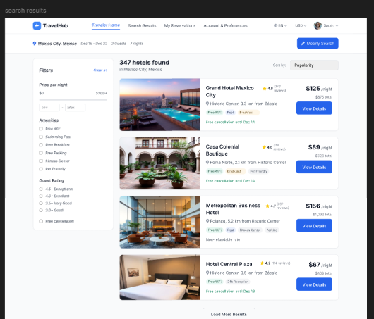

# Busqueda de hospedajes y filtros

## Busqueda inicial

Desde las pantallas `Home` y `Home Search`, el usuario puede buscar hoteles usando criterios basicos.

### Campos principales

- Destino
- Check-in
- Check-out
- Guests
- Boton `Search Hotels`

### Paso a paso

1. Ingrese el destino en el campo correspondiente.
2. Seleccione la fecha de check-in.
3. Seleccione la fecha de check-out.
4. Elija la cantidad de huespedes.
5. Presione `Search Hotels`.

**Resultado esperado**  
El sistema muestra una lista de resultados disponibles para los criterios definidos.

## Resultados de busqueda

En la vista `Search Results`, el usuario puede:

- Comparar propiedades disponibles.
- Revisar precios y ubicacion.
- Entrar al detalle de un hotel.
- Ajustar filtros de busqueda.

## Uso de filtros

### Paso a paso

1. Abra la seccion de filtros en la pagina de resultados.
2. Ajuste los criterios disponibles, por ejemplo:
   1. Rango de precio.
   2. Tipo de propiedad.
   3. Calificacion.
   4. Servicios o amenidades.
3. Aplique el filtro.
4. Revise la lista actualizada.

**Resultado esperado**  
La busqueda queda acotada segun las preferencias del usuario.

## Mensajes y estados relacionados con la busqueda

Durante la busqueda, el portal puede presentar:

- Mensajes de ausencia de resultados.
- Alertas de fechas invalidas.
- Avisos sobre disponibilidad limitada.
