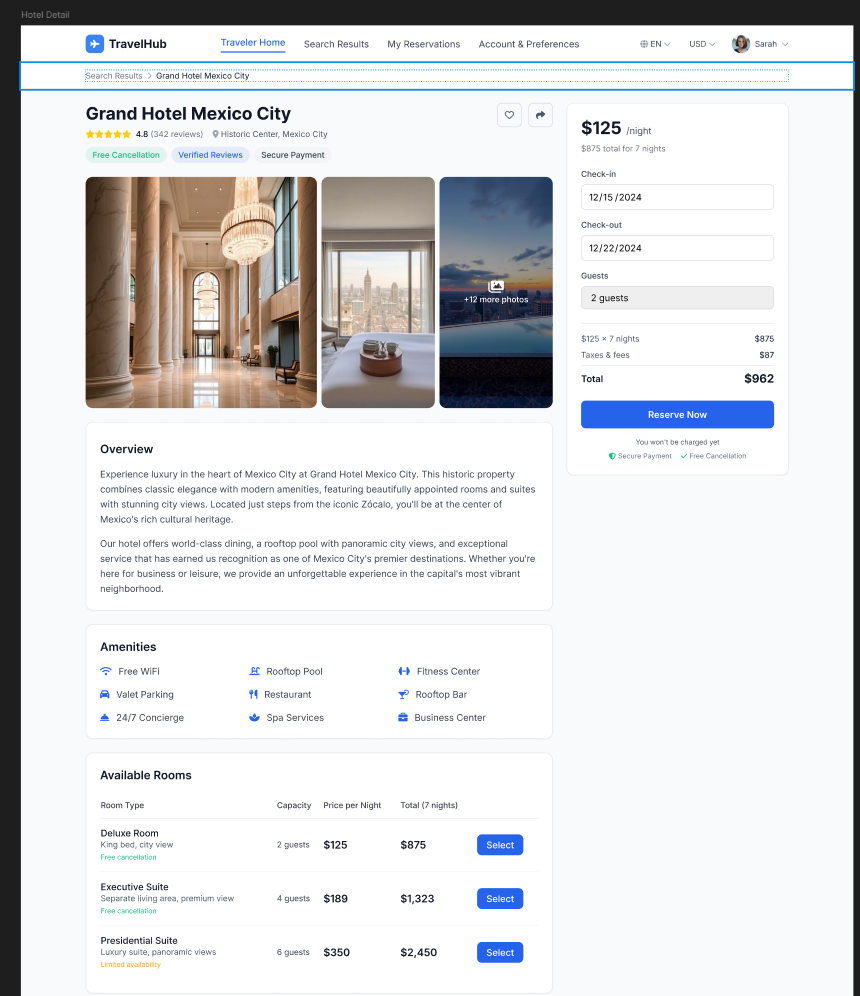

# Detalle de propiedad y seleccion de tarifa

## Visualizacion del detalle de la propiedad

La pantalla `Property Details` permite revisar la informacion completa de un hotel antes de reservar.

## Informacion disponible

- Nombre del hotel.
- Ubicacion.
- Calificacion.
- Galeria o imagen principal.
- Navegacion tipo breadcrumb desde `Search Results`.
- Acceso al perfil del usuario.

### Paso a paso

1. Desde `Search Results`, seleccione una propiedad.
2. Revise la informacion general del hotel.
3. Verifique servicios, ubicacion y calificacion.
4. Consulte las habitaciones o tarifas disponibles.

**Resultado esperado**  
El usuario identifica si la propiedad cumple con sus necesidades de viaje.

## Seleccion de fechas, capacidad y tarifa

### Paso a paso

1. Valide que las fechas de viaje sean correctas.
2. Revise el tipo de habitacion o tarifa.
3. Confirme la capacidad maxima permitida.
4. Revise politicas visibles como cancelacion, condiciones o restricciones.
5. Seleccione la opcion para reservar.

**Resultado esperado**  
La propiedad y la tarifa quedan listas para pasar al proceso de reserva.

## Estado de reserva en espera

TravelHub puede mostrar una pantalla de reserva en espera antes de la confirmacion final. En este estado, la plataforma conserva temporalmente la seleccion realizada mientras termina la validacion del proceso.

### Recomendacion de uso

1. Revise el estado mostrado en pantalla.
2. Confirme si la reserva requiere una accion adicional.
3. Espere la confirmacion final o regrese a sus reservas para consultar el resultado.
