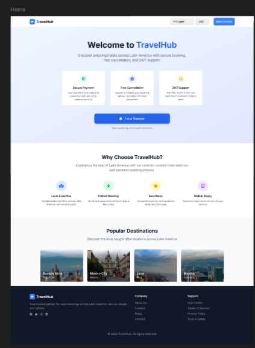

# Manual del portal web

El portal web de TravelHub permite al cliente buscar hospedajes, revisar informacion de hoteles, crear reservas y administrar sus viajes.

## En esta seccion aprendera

- Como ingresar al portal y autenticarse.
- Como buscar propiedades y aplicar filtros.
- Como revisar el detalle de una propiedad.
- Como reservar, confirmar, modificar o cancelar.
- Como consultar el perfil y los mensajes visibles del sistema.

## Pantallas principales

- `Home`
- `Home Search`
- `Login`
- `Search Results`
- `Property Details`
- `Hold Reservation`
- `Booking Confirmation`
- `My Reservations`
- `Modify Reservation`
- `Cancel Reservation`
- `Payment Pending`
- `Payment Cancelled`

Continua con los temas del menu lateral para revisar cada flujo.
