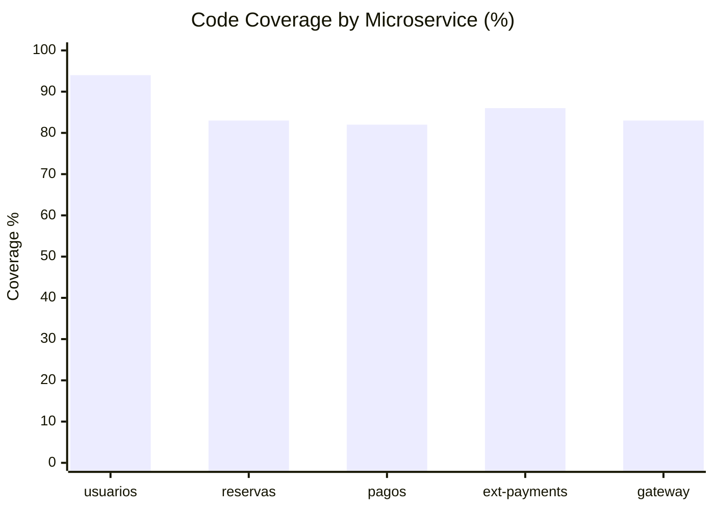

# Microservices Test Coverage Report

Fecha: 2026-04-11
Alcance: ejecucion de pruebas unitarias/integracion por microservicio con `pytest --cov=app --cov-report=term --cov-report=xml:coverage.xml`.

## Resumen

| Microservicio | Tests (passed) | Cobertura total |
|---|---:|---:|
| usuarios | 54 | 94% |
| reservas | 86 | 83% |
| pagos | 22 | 82% |
| ext-payments | 11 | 86% |
| gateway | 156 | 83% |

**Total tests ejecutados:** 329

**Cobertura agregada (ponderada por lineas):** 85%

- Lineas totales medidas: 3295
- Lineas cubiertas: 2791
- Lineas no cubiertas: 504

## Coverage Chart

## Archivos de cobertura generados

- microservices/usuarios/coverage.xml
- microservices/reservas/coverage.xml
- microservices/pagos/coverage.xml
- microservices/ext-payments/coverage.xml
- microservices/gateway/coverage.xml

## Notas

- Todos los suites de prueba finalizaron exitosamente.
- Se observaron warnings de `datetime.utcnow()` deprecado en varios servicios; no bloquean la ejecucion, pero conviene migrar a fechas timezone-aware.
