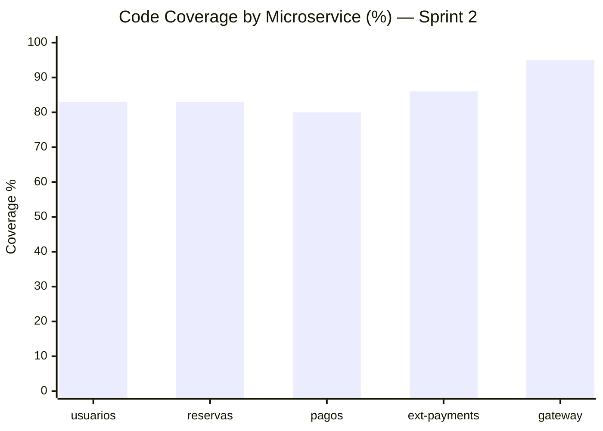
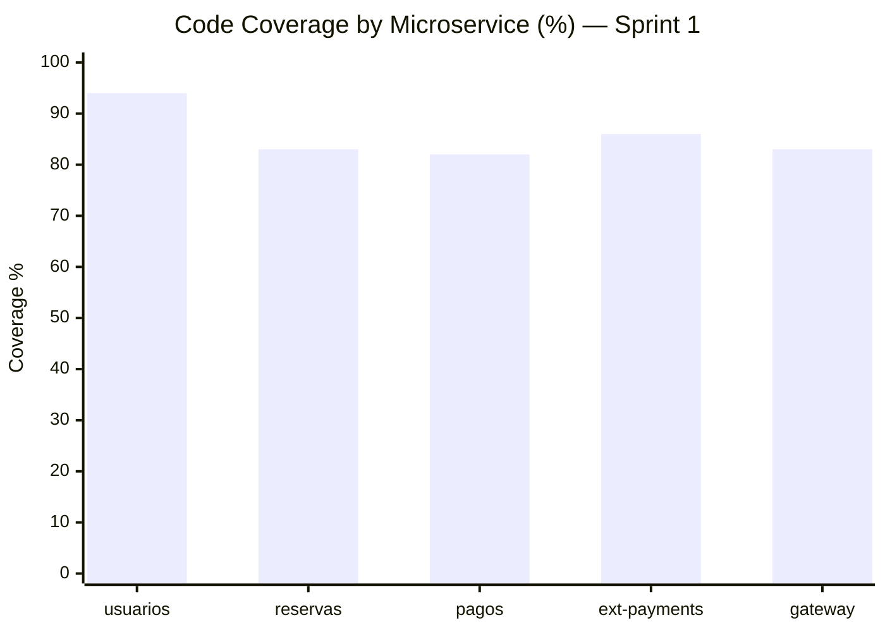

# Microservices Test Coverage Report

Fecha: 2026-04-26 (Sprint 2)  
Fecha anterior: 2026-04-11 (Sprint 1)  
Alcance: ejecucion de pruebas unitarias/integracion por microservicio con `pytest --cov=app --cov-report=term --cov-report=xml:coverage.xml`.

## Resumen

| Microservicio | Tests S1 | Tests S2 | Cobertura S1 | Cobertura S2 | Δ |
|---|---:|---:|---:|---:|---:|
| usuarios | 54 | 73 | 94% | 83% | -11 pp |
| reservas | 86 | 111 | 83% | 83% | — |
| pagos | 22 | 32 | 82% | 80% | -2 pp |
| ext-payments | 11 | 11 | 86% | 86% | — |
| gateway | 156 | 224 | 83% | 95% | +12 pp |

**Total tests ejecutados:** 451 (+122 vs Sprint 1)

**Cobertura agregada (ponderada por lineas):** 86% (+1 pp vs Sprint 1)

- Lineas totales medidas: 3 690 (+395 — código nuevo de Sprint 2)
- Lineas cubiertas: 3 160
- Lineas no cubiertas: 530

## Coverage Chart

### Sprint 2 (2026-04-26)

### Sprint 1 (2026-04-11) — referencia

## Archivos de cobertura generados

- microservices/usuarios/coverage.xml
- microservices/reservas/coverage.xml
- microservices/pagos/coverage.xml
- microservices/ext-payments/coverage.xml
- microservices/gateway/coverage.xml

## Notas

- Todos los suites de prueba finalizaron exitosamente en Sprint 2.
- La cobertura de `gateway` subió de 83% → 95% (+12 pp) gracias a las pruebas nuevas de Sprint 2 (224 tests vs 156).
- La cobertura de `usuarios` bajó de 94% → 83% (-11 pp): se agregó código nuevo de Sprint 2 (MFA, admin flows) que aún no tiene cobertura completa.
- La cobertura de `pagos` bajó levemente 82% → 80% (-2 pp) por el código de mensajería MQ SSL añadido en Sprint 2.
- Se observaron warnings de `datetime.utcnow()` deprecado en varios servicios; no bloquean la ejecucion, pero conviene migrar a fechas timezone-aware.
