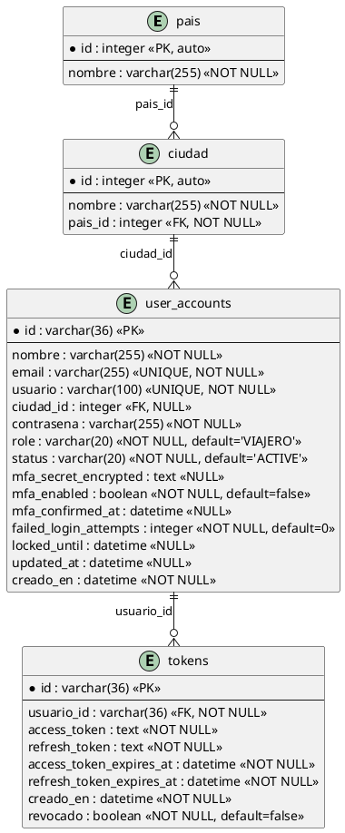
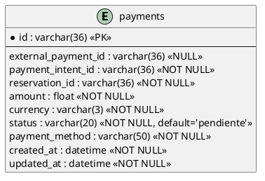
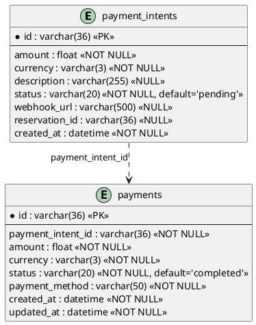
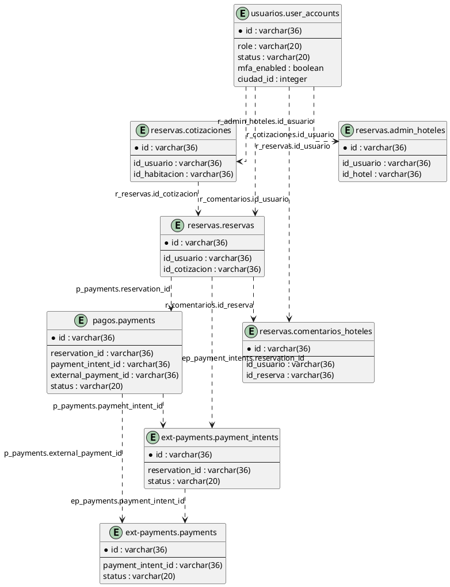

# Diagramas de Base de Datos por Microservicio

Este documento refleja el esquema real que hoy materializa cada microservicio mediante `db.create_all()`. Incluye los servicios con persistencia propia y aclara cuáles no tienen base de datos local.

## 1) Microservicio Gateway

El microservicio `gateway` no define modelos SQLAlchemy ni crea tablas propias. Su función es orquestación y proxy hacia los demás microservicios.

## 2) Microservicio Usuarios (`DB: usuarios`)

## 3) Microservicio Reservas (`DB: reservas`)

```plantuml
@startuml
hide methods
hide stereotypes
skinparam linetype ortho
skinparam shadowing false

entity "paises" as paises {
  * id : varchar(36) <<PK>>
  --
  nombre : varchar(100) <<NOT NULL>>
}

entity "ciudades" as ciudades {
  * id : varchar(36) <<PK>>
  --
  nombre : varchar(100) <<NOT NULL>>
  id_pais : varchar(36) <<FK, NOT NULL>>
}

entity "hoteles" as hoteles {
  * id : varchar(36) <<PK>>
  --
  nombre : varchar(200) <<NOT NULL>>
  email : varchar(200) <<NOT NULL>>
  descripcion : text <<NULL>>
  amenidades : text <<NULL>>
  id_ciudad : varchar(36) <<FK, NOT NULL>>
}

entity "tipos_habitacion" as tipos_habitacion {
  * id : varchar(36) <<PK>>
  --
  nombre : varchar(120) <<NOT NULL>>
  descripcion : text <<NULL>>
  capacidad : integer <<NOT NULL>>
  camas : integer <<NOT NULL>>
  id_hotel : varchar(36) <<FK, NOT NULL>>
  created_at : datetime <<NOT NULL>>
  updated_at : datetime <<NOT NULL>>
}

entity "habitaciones" as habitaciones {
  * id : varchar(36) <<PK>>
  --
  tipo : varchar(100) <<NOT NULL>>
  nro_habitacion : integer <<NOT NULL>>
  capacidad : integer <<NOT NULL>>
  camas : integer <<NOT NULL>>
  id_hotel : varchar(36) <<FK, NOT NULL>>
  id_tipo_habitacion : varchar(36) <<FK, NULL>>
}

entity "tarifas" as tarifas {
  * id : varchar(36) <<PK>>
  --
  nombre : varchar(100) <<NOT NULL>>
  valor : float <<NOT NULL>>
  descuento : float <<NOT NULL, default=0.0>>
  id_habitacion : varchar(36) <<FK, NOT NULL>>
}

entity "temporadas" as temporadas {
  * id : varchar(36) <<PK>>
  --
  nombre : varchar(120) <<NOT NULL>>
  descripcion : text <<NULL>>
  activo : boolean <<NOT NULL, default=true>>
}

entity "temporadas_detalle" as temporadas_detalle {
  * id : varchar(36) <<PK>>
  --
  id_temporada : varchar(36) <<FK, NOT NULL>>
  fecha_inicio : date <<NOT NULL>>
  fecha_fin : date <<NOT NULL>>
}

entity "planes_tarifarios" as planes_tarifarios {
  * id : varchar(36) <<PK>>
  --
  nombre : varchar(120) <<NOT NULL>>
  descripcion : text <<NULL>>
  moneda : varchar(3) <<NOT NULL, default='USD'>>
  activo : boolean <<NOT NULL, default=true>>
  id_tipo_habitacion : varchar(36) <<FK, NOT NULL>>
}

entity "reglas_tarifarias" as reglas_tarifarias {
  * id : varchar(36) <<PK>>
  --
  id_plan_tarifario : varchar(36) <<FK, NOT NULL>>
  id_temporada : varchar(36) <<FK, NULL>>
  fecha_inicio : date <<NULL>>
  fecha_fin : date <<NULL>>
  dias_semana_mask : varchar(20) <<NULL>>
  precio_base_noche : float <<NOT NULL>>
  prioridad : integer <<NOT NULL, default=0>>
  min_noches : integer <<NULL>>
  combinable : boolean <<NOT NULL, default=false>>
  activo : boolean <<NOT NULL, default=true>>
}

entity "estados" as estados {
  * id : varchar(36) <<PK>>
  --
  nombre : varchar(100) <<NOT NULL>>
  descripcion : text <<NULL>>
}

entity "cotizaciones" as cotizaciones {
  * id : varchar(36) <<PK>>
  --
  id_usuario : varchar(36) <<NOT NULL>>
  id_habitacion : varchar(36) <<FK, NOT NULL>>
  fecha_ingreso : date <<NOT NULL>>
  fecha_salida : date <<NOT NULL>>
  nro_personas : integer <<NOT NULL>>
  total : float <<NOT NULL>>
  moneda : varchar(3) <<NOT NULL, default='USD'>>
  created_at : datetime <<NOT NULL>>
  expires_at : datetime <<NOT NULL>>
}

entity "cotizacion_detalle" as cotizacion_detalle {
  * id : varchar(36) <<PK>>
  --
  id_cotizacion : varchar(36) <<FK, NOT NULL>>
  fecha_noche : date <<NOT NULL>>
  id_plan_tarifario : varchar(36) <<FK, NOT NULL>>
  id_regla_tarifaria : varchar(36) <<FK, NOT NULL>>
  precio_noche : float <<NOT NULL>>
  subtotal_noche : float <<NOT NULL>>
}

entity "reservas" as reservas {
  * id : varchar(36) <<PK>>
  --
  fecha_ingreso : datetime <<NOT NULL>>
  fecha_salida : datetime <<NOT NULL>>
  total : float <<NOT NULL>>
  nro_personas : integer <<NOT NULL>>
  id_usuario : varchar(36) <<NOT NULL>>
  id_pais : varchar(36) <<FK, NOT NULL>>
  id_habitacion : varchar(36) <<FK, NOT NULL>>
  id_estado : varchar(36) <<FK, NOT NULL>>
  id_cotizacion : varchar(36) <<FK, NULL>>
  created_at : datetime <<NULL>>
}

entity "reserva_detalle_tarifa" as reserva_detalle_tarifa {
  * id : varchar(36) <<PK>>
  --
  id_reserva : varchar(36) <<FK, NOT NULL>>
  fecha_noche : date <<NOT NULL>>
  id_plan_tarifario : varchar(36) <<FK, NOT NULL>>
  id_regla_tarifaria : varchar(36) <<FK, NOT NULL>>
  precio_noche : float <<NOT NULL>>
  subtotal_noche : float <<NOT NULL>>
}

entity "pagos" as pagos_reservas {
  * id : varchar(36) <<PK>>
  --
  fecha_pago : datetime <<NOT NULL>>
  total : float <<NOT NULL>>
  estado : varchar(50) <<NOT NULL>>
  id_pais : varchar(36) <<FK, NOT NULL>>
  id_reserva : varchar(36) <<FK, NOT NULL>>
}

entity "notificaciones" as notificaciones {
  * id : varchar(36) <<PK>>
  --
  fecha_notif : datetime <<NOT NULL>>
  titulo : varchar(200) <<NOT NULL>>
  descripcion : text <<NULL>>
  id_reserva : varchar(36) <<FK, NOT NULL>>
}

entity "comentarios_hoteles" as comentarios_hoteles {
  * id : varchar(36) <<PK>>
  --
  id_hotel : varchar(36) <<FK, NOT NULL>>
  id_usuario : varchar(36) <<NOT NULL>>
  id_reserva : varchar(36) <<FK, NOT NULL>>
  comentario : text <<NULL>>
  rating : integer <<NOT NULL, check 1..5>>
  created_at : datetime <<NOT NULL>>
  updated_at : datetime <<NOT NULL>>
  activo : boolean <<NOT NULL, default=true>>
}

entity "admin_hoteles" as admin_hoteles {
  * id : varchar(36) <<PK>>
  --
  id_usuario : varchar(36) <<NOT NULL>>
  id_hotel : varchar(36) <<FK, NOT NULL>>
  created_at : datetime <<NOT NULL>>
}

entity "room_holds" as room_holds {
  * id : varchar(36) <<PK>>
  --
  id_habitacion : varchar(36) <<FK, NOT NULL>>
  id_usuario : varchar(36) <<NOT NULL>>
  fecha_ingreso : datetime <<NOT NULL>>
  fecha_salida : datetime <<NOT NULL>>
  created_at : datetime <<NOT NULL>>
  expires_at : datetime <<NOT NULL>>
}

entity "reservations" as reservations {
  * id : varchar(36) <<PK>>
  --
  user_id : varchar(36) <<NOT NULL>>
  event_id : varchar(36) <<NOT NULL>>
  seat_number : varchar(50) <<NULL>>
  status : varchar(20) <<NOT NULL, default='pending'>>
  created_at : datetime <<NOT NULL>>
  updated_at : datetime <<NOT NULL>>
}

paises ||--o{ ciudades : id_pais
ciudades ||--o{ hoteles : id_ciudad
hoteles ||--o{ tipos_habitacion : id_hotel
tipos_habitacion ||--o{ habitaciones : id_tipo_habitacion
hoteles ||--o{ habitaciones : id_hotel
habitaciones ||--o{ tarifas : id_habitacion
tipos_habitacion ||--o{ planes_tarifarios : id_tipo_habitacion
temporadas ||--o{ temporadas_detalle : id_temporada
temporadas ||--o{ reglas_tarifarias : id_temporada
planes_tarifarios ||--o{ reglas_tarifarias : id_plan_tarifario
habitaciones ||--o{ cotizaciones : id_habitacion
cotizaciones ||--o{ cotizacion_detalle : id_cotizacion
planes_tarifarios ||--o{ cotizacion_detalle : id_plan_tarifario
reglas_tarifarias ||--o{ cotizacion_detalle : id_regla_tarifaria
paises ||--o{ reservas : id_pais
estados ||--o{ reservas : id_estado
habitaciones ||--o{ reservas : id_habitacion
cotizaciones ||--o| reservas : id_cotizacion
reservas ||--o{ reserva_detalle_tarifa : id_reserva
planes_tarifarios ||--o{ reserva_detalle_tarifa : id_plan_tarifario
reglas_tarifarias ||--o{ reserva_detalle_tarifa : id_regla_tarifaria
reservas ||--o{ pagos_reservas : id_reserva
paises ||--o{ pagos_reservas : id_pais
reservas ||--o{ notificaciones : id_reserva
hoteles ||--o{ comentarios_hoteles : id_hotel
reservas ||--o{ comentarios_hoteles : id_reserva
habitaciones ||--o{ room_holds : id_habitacion
hoteles ||--o{ admin_hoteles : id_hotel

note bottom of room_holds
Indices:
- ix_room_holds_habitacion_dates (id_habitacion, fecha_ingreso, fecha_salida)
- ix_room_holds_expires_at (expires_at)
end note

note bottom of comentarios_hoteles
Constraints / indices:
- chk_comentarios_hoteles_rating_1_5 (rating >= 1 AND rating <= 5)
- uq_comentarios_hoteles_usuario_reserva (id_usuario, id_reserva)
- ix_comentarios_hoteles_id_hotel (id_hotel)
- ix_comentarios_hoteles_id_hotel_created_at (id_hotel, created_at)
end note

note bottom of admin_hoteles
Constraints / indices:
- uq_admin_hotel (id_usuario, id_hotel)
- ix_admin_hoteles_id_usuario (id_usuario)
end note

note bottom of reservations
Tabla scaffold heredada (eventos genéricos).
No relacionada con el modelo hotelero principal.
end note
@enduml
```

## 4) Microservicio Pagos (`DB: pagos`)

## 5) Microservicio Ext-Payments (`DB: ext-payments`)

## 6) Relaciones lógicas entre microservicios (sin FK física)

