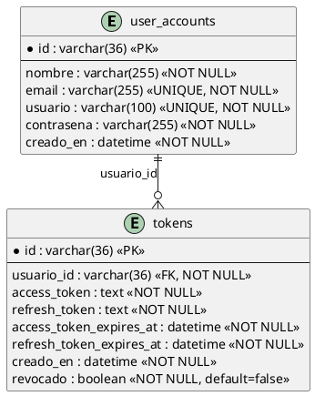
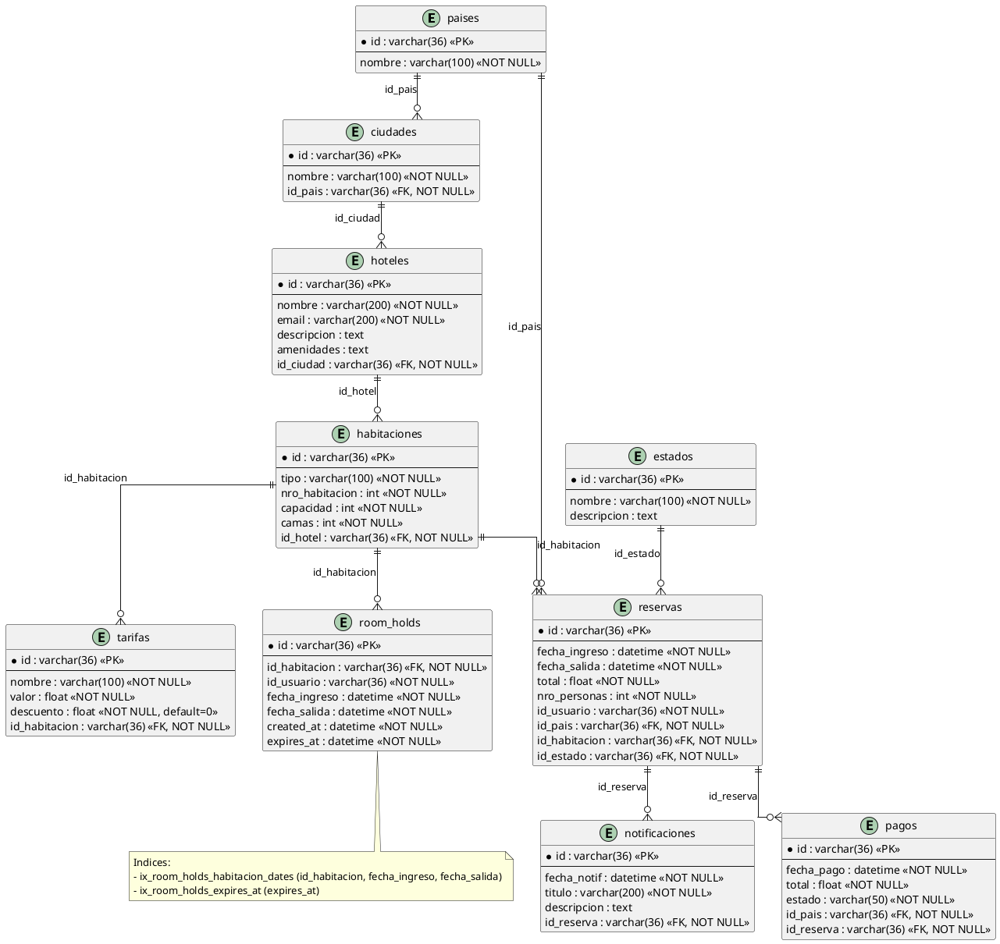
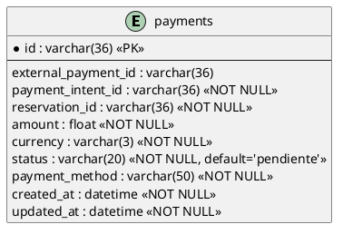
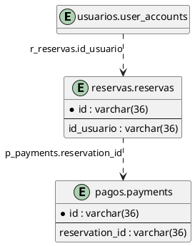

# Diagramas de Base de Datos por Microservicio

Este documento separa el modelo actual de BD por microservicio: `usuarios`, `reservas` y `pagos`.

## 1) Microservicio Usuarios (`DB: usuarios`)

## 2) Microservicio Reservas (`DB: reservas`)

## 3) Microservicio Pagos (`DB: pagos`)

## Relaciones lógicas entre microservicios (sin FK física)

